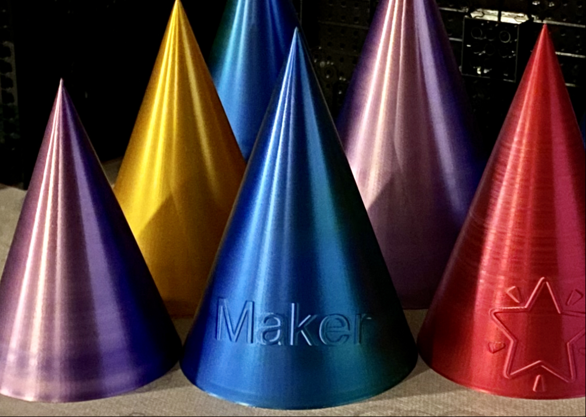

# party-hat-generator

Party hat generator for 3D-printing. Not suitable for children due to possible sharp edges and possible printing problems like delamination.
  
Print using vase - or spiral mode for best results. See slicing hints when exporting.
  
Note: Text cutting and union + filleting is a little bit buggy, maybe used wrong, so all words will not work. Font size below 20 will increase failure rate.

## Installation
Tested with Python 3.9.
1. Clone this repository.
2. Create a virtual environment.
3. Install python dependencies using `pip install -r requirements.txt`
4. For using emojis, download the Google Noto Emoji font here: https://fonts.google.com/noto/specimen/Noto+Emoji and put the font in a new folder called Noto_Emoji next to main.py. Like this: "Noto_Emoji/NotoEmoji-VariableFont_wght.ttf".

The last step will install a specific cadquery version, as this project is dependent on 3mf export format support. You could need to upgrade your slicer to use the produced files.

## Making a hat
Edit list of names, icons and/or font size in main.py. Run main.py, and hopefully get a 3mf file ready for slicing using Cura or another 3D printer software.
